# **GAMES101**

### ***作业1效果图***

##### 1.正常显示三角形

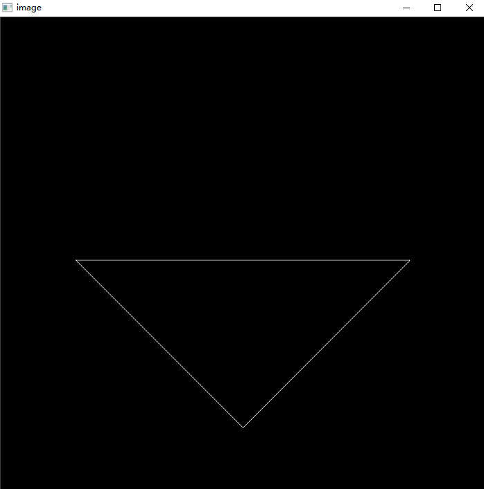

##### 2.逆时针旋转45度

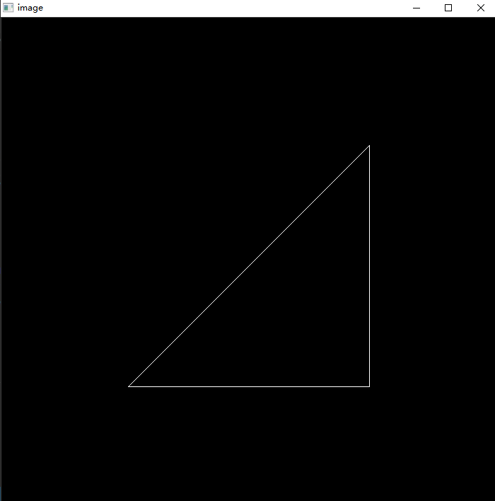

##### 3.逆时针旋转90度

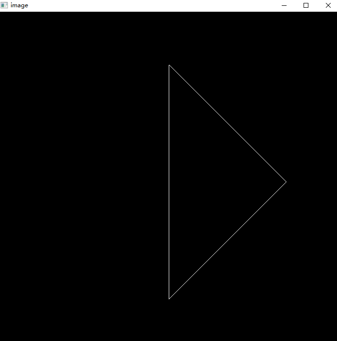

### ***作业2效果图***

##### 1.无抗锯齿

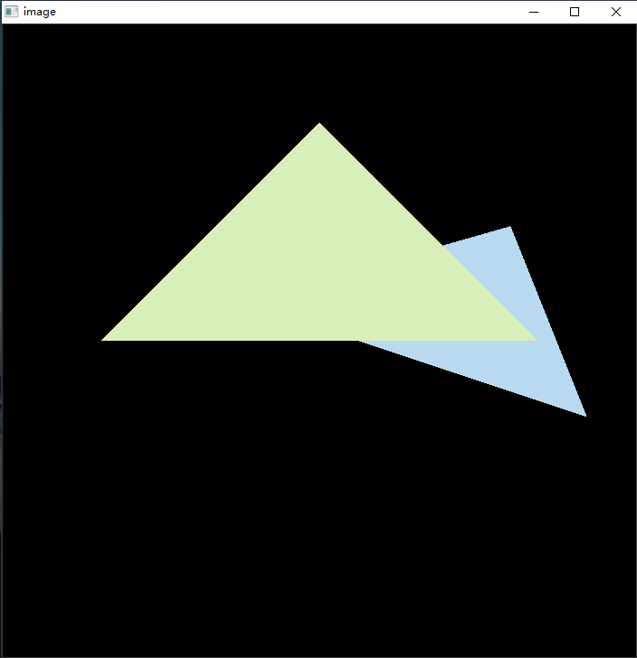

##### 2.有MSAA

##### 3.有SSAA

### ***作业3效果图***

##### 1.phong

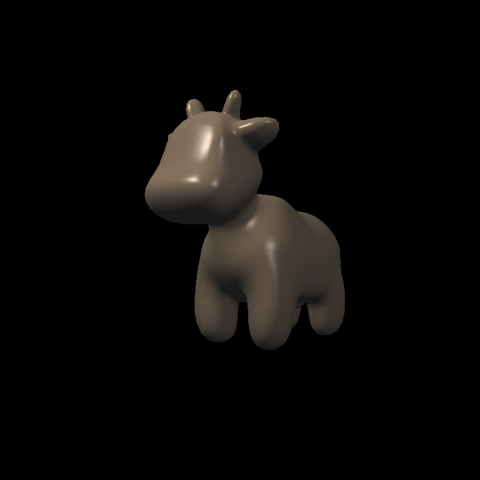

##### 2.normal

##### 3.displacement

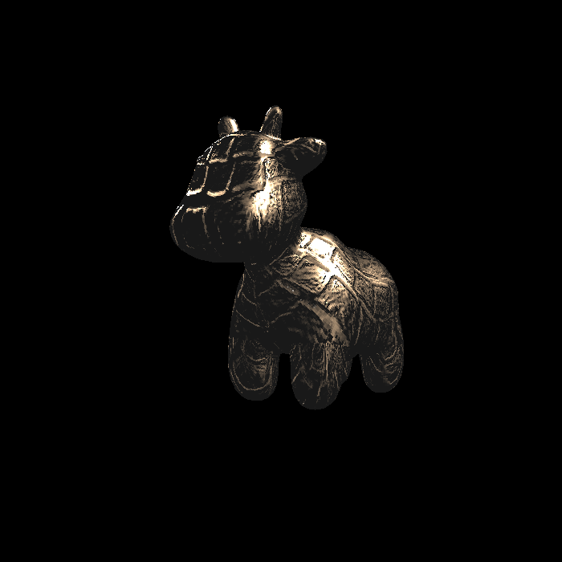

##### 4.bump

##### 5.texture

##### 6.texture_bilinear

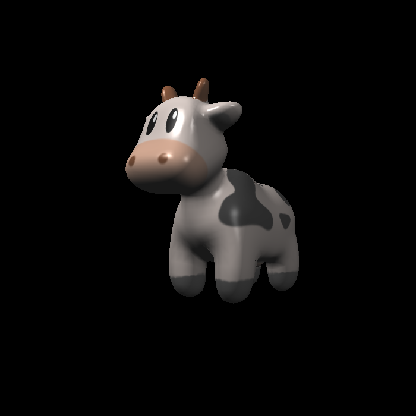

### ***作业4效果图***

##### 1.无反走样_01

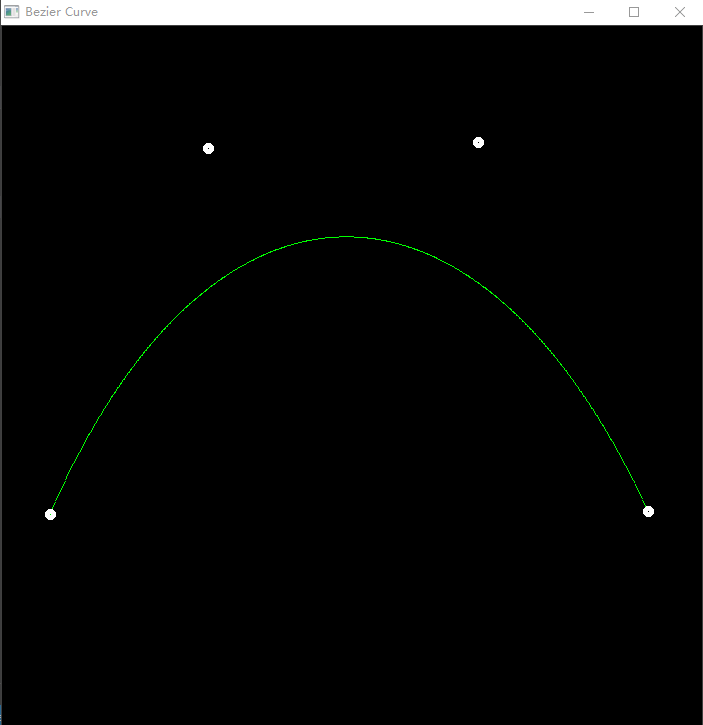

##### 2.无反走样_02

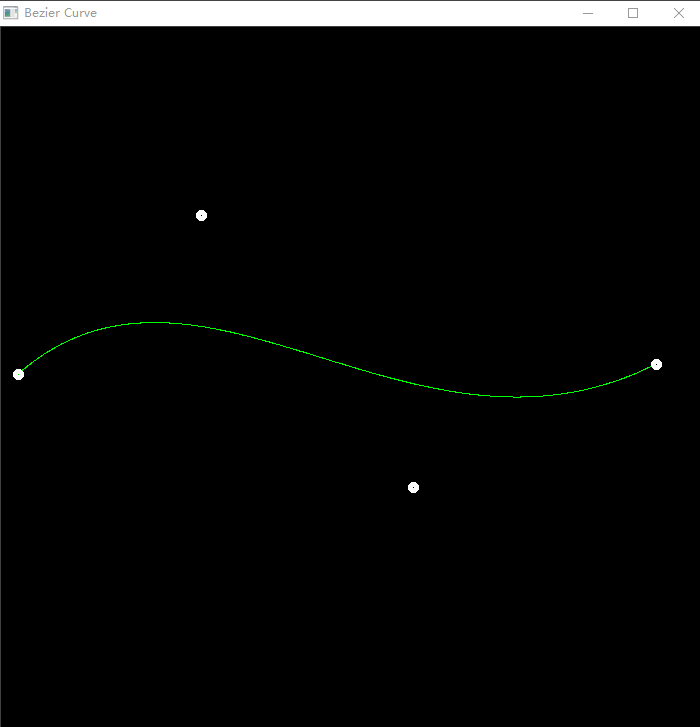

##### 3.反走样_01

##### 4.反走样_02

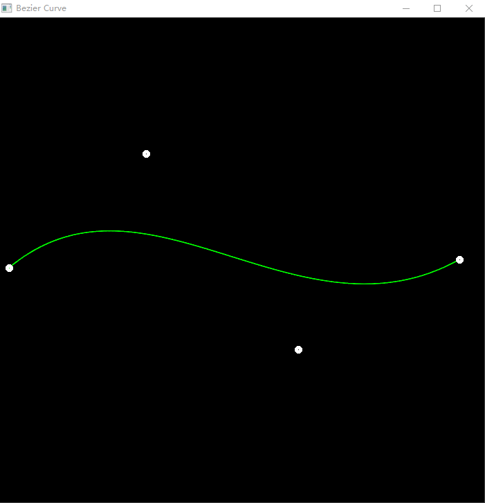

### ***作业5效果图***

##### 1.光线追踪

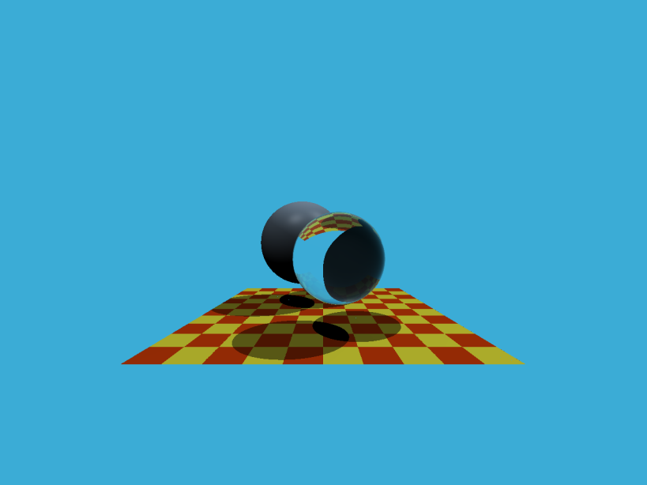

### ***作业6效果图***

##### 1.BVH

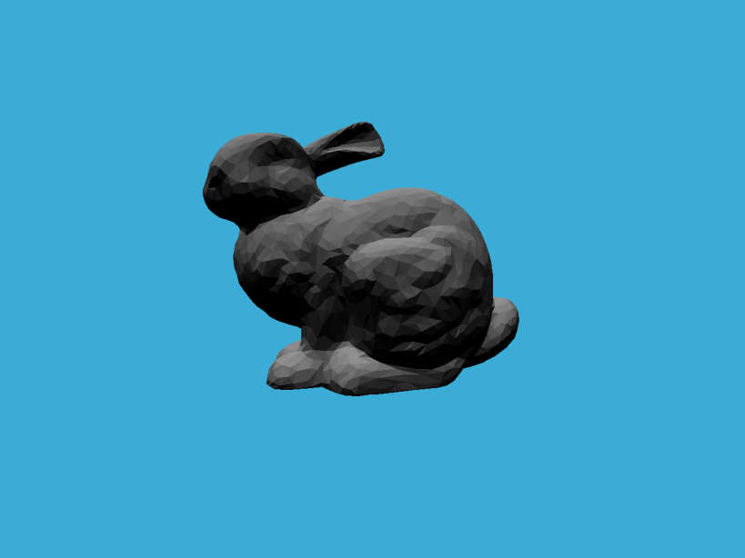

##### 2.BVH_Time

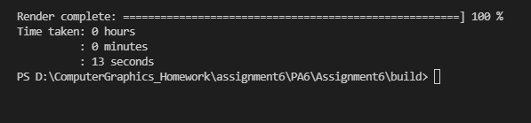

##### 3.SVH_Time

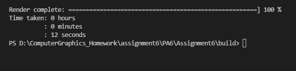

### ***作业7效果图***

##### 1.Diffuse_SPP16

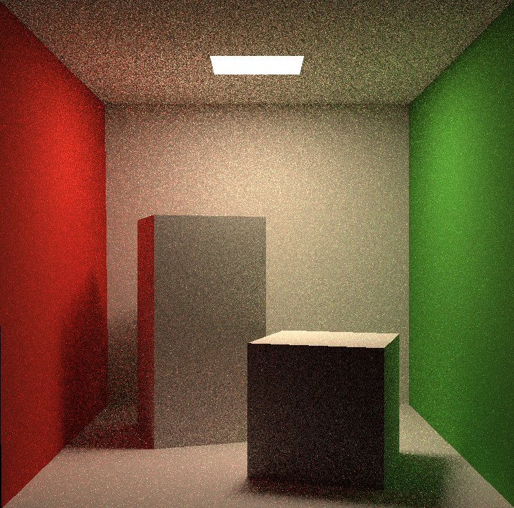

##### 2.Diffuse_SPP16_Time

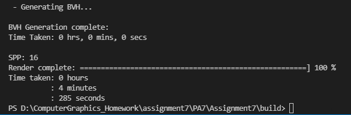

##### 3.Diffuse_SPP256

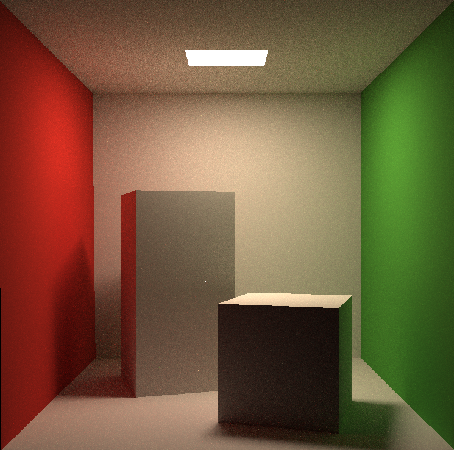

##### 4.Diffuse_SPP256_Time

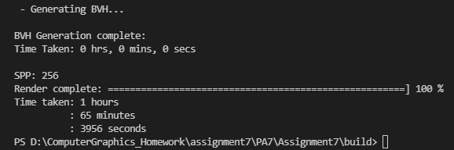

##### 5.Microfacet_SPP16

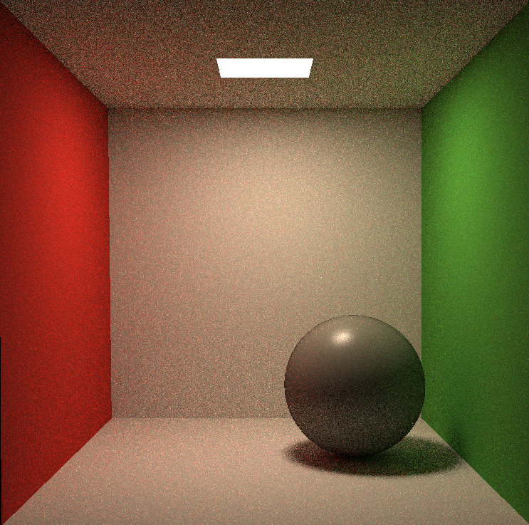

##### 6.Microfacet_SPP16_Time

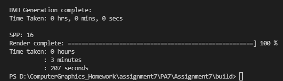

##### 7.Microfacet_SPP256

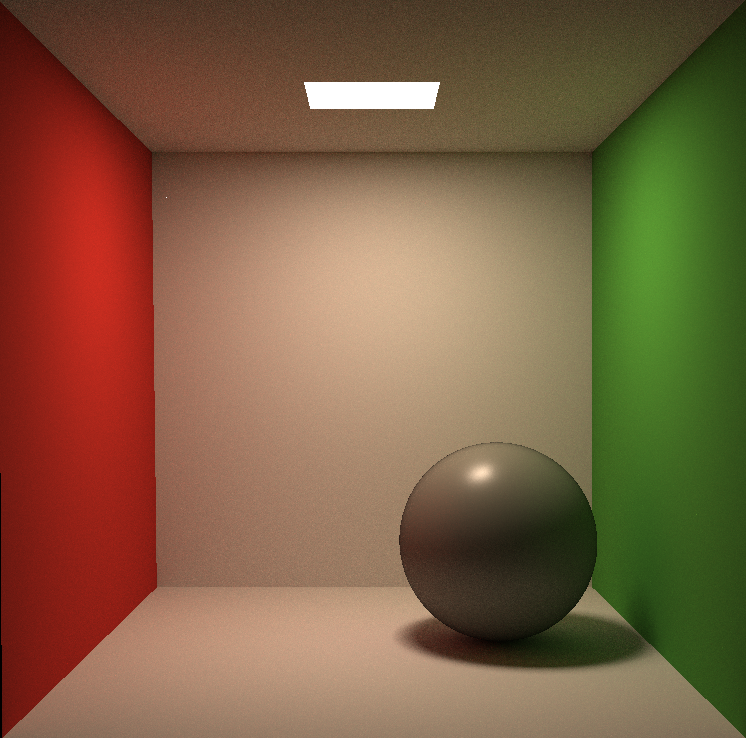

##### 8.Microfacet_SPP256_Time

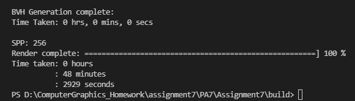
